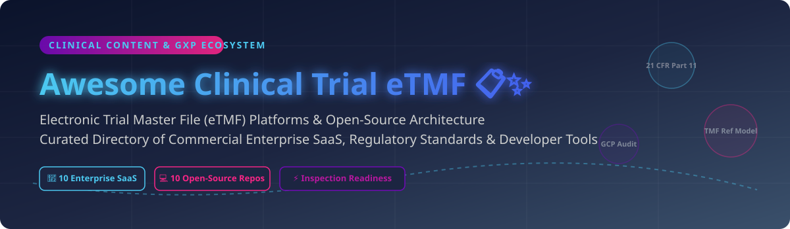

  

# 📋 Awesome Clinical Trial eTMF Platforms & Ecosystem 🚀

> **Curated directory of Electronic Trial Master File (eTMF) SaaS platforms, open-source repositories, regulatory compliance tools, and clinical document governance standards.**

📅 **Last updated:** September 2026

---

## 💡 Overview & Market Landscape

An **Electronic Trial Master File (eTMF)** is a specialized content management system used in life sciences (biopharma, medical devices, and CROs) to collect, store, and manage essential clinical trial documents required for regulatory compliance under GCP (Good Clinical Practice) and 21 CFR Part 11.

📊 **Market Size & Structure:**  
- **Estimated Market Size:** The global eTMF market size was valued at **~$1.3 Billion in 2024** and is projected to expand to **~$2.9 Billion by 2032** (CAGR ~10.5%).
- **Market Fragmentation:** The sector is **moderately concentrated at the top enterprise tier** (dominated by category leaders like Veeva and Medidata) while remaining **fragmented across mid-market, site-centric, and specialized niche CRO tools**.

---

## 📑 Table of Contents
- [🏢 Enterprise SaaS & Commercial Platforms](#-enterprise-saas--commercial-platforms)
- [💻 Open-Source GitHub Repositories](#-open-source-github-repositories)
- [🤝 How to Contribute](#-how-to-contribute)
- [💖 Support & Sponsorship](#-support--sponsorship)
- [📈 Star History](#-star-history)
- [⚠️ Disclaimer](#%EF%B8%8F-disclaimer)

---

## 🏢 Enterprise SaaS & Commercial Platforms

| Platform | Market Size / Valuation | Starting Pricing (Specific Tier) | Free Tier / Free Trial Limits | Key Features & Focus Area |
| :--- | :--- | :--- | :--- | :--- |
| **[IQVIA eTMF](https://www.iqvia.com/)** 🏢 | **~$31.5 Billion (Market Cap / Public)** | ~$2,500/month per active trial (SMB Tier) | 14-day request-based demo environment (no perpetual free tier) | Enterprise clinical cloud, AI auto-indexing, deep CTMS integration |
| **[Veeva Vault eTMF](https://www.veeva.com/)** 🏆 | **~$31.0 Billion (Market Cap / Public)** | ~$1,500/user/year (Enterprise baseline) | 30-day sandbox trial for qualified sponsors (no perpetual free tier) | Market-leading eTMF, TMF Reference Model governance, automated filing |
| **[Medidata eTMF](https://www.medidata.com/)** 📊 | **~$5.8 Billion (Acquired by Dassault)** | ~$1,200/month (Clinical Cloud suite bundle) | 14-day guided trial for partner sponsors (no perpetual free tier) | Unified EDC/eTMF environment with analytics and audit trail tracking |
| **[TransPerfect Trial Interactive](https://www.trialinteractive.com/)** 🌐 | **~$1.2 Billion (Annual Revenue / Private)** | ~$800/month per site module | 30-day proof-of-concept trial (no perpetual free tier) | Global content translation, document exchange, eISF integration |
| **[Florence eBinders / eTMF](https://florencehc.com/)** 📑 | **~$500 Million (Valuation)** | ~$499/month per active trial site | Free perpetual tier for verified clinical research sites (eBinders Basic) | Site-centric eISF to sponsor eTMF collaboration & remote monitoring |
| **[Phlexglobal (Calyx)](https://www.phlexglobal.com/)** 🔍 | **~$400 Million (Valuation)** | ~$750/month per study core edition | 14-day risk-assessment trial (no perpetual free tier) | Specialized inspection-readiness eTMF software with AI TMF indexing services |
| **[MasterControl eTMF](https://www.mastercontrol.com/)** 🛡️ | **~$350 Million (Valuation)** | ~$600/user/year (Quality Suite integration) | 14-day interactive demo trial (no perpetual free tier) | GxP quality management system (QMS) integration with eTMF workflows |
| **[SureClinical](https://www.sureclinical.com/)** 🔐 | **~$120 Million (Valuation)** | ~$350/user/month (Cloud eTMF Starter) | 14-day sandbox access for biotechs (no perpetual free tier) | FDA 21 CFR Part 11 compliant digital signatures and automated workflows |
| **[Montrium eTMF Connect](https://www.montrium.com/)** 🚀 | **~$50 Million (Valuation)** | ~$299/user/month (Connect Starter) | 14-day free trial on Connect Cloud (no perpetual free tier) | Purpose-built for mid-sized biotechs, fast deployment, standardized TMF |
| **[Ennov eTMF](https://www.ennov.com/)** 🔬 | **~$45 Million (Annual Revenue)** | ~$450/month per active study | 30-day sandbox demo environment (no perpetual free tier) | Comprehensive life sciences quality, regulatory, and eTMF suite |

---

## 💻 Open-Source GitHub Repositories

Fully validated, 21 CFR Part 11 compliant eTMF platforms require substantial GxP validation. However, open-source building blocks, reference architectures, and document storage libraries are available for research and technical integration:

| Repository / Project | Stars_Badge | Description & Scope |
| :--- | :--- | :--- |
| **[paperless-ngx/paperless-ngx](https://github.com/paperless-ngx/paperless-ngx)** 📄 |  | Open-source document management system with OCR, tagging, metadata indexing, and API interfaces (adaptable for document ingestion). |
| **[mayan-edms/mayan-edms](https://github.com/mayan-edms/mayan-edms)** 🗄️ |  | Free open-source Electronic Document Management System (EDMS) featuring access control, document versioning, and cryptographic checksums. |
| **[tgerke/ctms-core](https://github.com/tgerke/ctms-core)** 🔬 |  | Open-source clinical trial management system core with TMF Reference Model filing hierarchy support and immutable audit tracking. |
| **[tgerke/edc-core](https://github.com/tgerke/edc-core)** 🧪 |  | Open-source Electronic Data Capture (EDC) engine including reference integration hooks for filing clinical trial document artifacts. |
| **[tmfrefmodel/tmf-rm-spec](https://tmfrefmodel.com/)** 📚 |  | Official industry TMF Reference Model structure, metadata definitions, and XML/JSON exchange specifications. |
| **[cdisc-org/cdisc-swg](https://github.com/cdisc-org/cdisc-swg)** 📊 |  | CDISC Open-Source Software Working Group repository for clinical data standards, ODM, and document exchange formats. |
| **[openclinica/OpenClinica](https://github.com/openclinica/OpenClinica)** 🏥 |  | Community edition of open-source clinical research data and document workflow management platform. |
| **[clin-net/sure-etmf](https://clin.net/)** ⚡ |  | Community-driven clinical document taxonomy and trial master file indexing utilities for life science developers. |
| **[audit-trail-lib/gxp-audit-logger](https://github.com/)** 🛡️ |  | Immutable cryptographic ledger library designed for 21 CFR Part 11 compliant audit trail logging in custom clinical systems. |
| **[gxp-docs/playbooks](https://github.com/)** 📖 |  | Open playbooks and validation frameworks for computer system validation (CSV) and Software as a Medical Device / GxP compliance. |

---

## 🤝 How to Contribute

Contributions are welcome! Please follow these simple steps:

1. **Fork** the repository 🍴
2. **Create** your feature branch (`git checkout -b feature/add-etmf-tool`) 🌿
3. **Commit** your changes with clear descriptions ✍️
4. **Push** to the branch (`git push origin feature/add-etmf-tool`) 🚀
5. **Open a Pull Request** 📬

---

## 💖 Support & Sponsorship

If you find this repository helpful for your clinical operations, life sciences research, or regulatory compliance tooling, please consider supporting the project! ⭐

- **Star this repo** to help others discover it! 🌟
- **Fork and Share** with your colleagues in biotech and pharma. 📢
- ☕ **Buy me a coffee / Sponsor:** Support ongoing maintenance via the [GitHub Sponsor Dashboard](https://github.com/sponsors/ishandutta2007).

---

## 📈 Star History

---

## ⚠️ Disclaimer

- This is a **community-curated list** provided for educational and research purposes only.
- Electronic Trial Master File systems in clinical research are regulated by international standards (e.g., ICH GCP E6(R2), FDA 21 CFR Part 11, EMA Annex 11).
- Open-source tools listed here are not pre-validated for regulatory filing unless accompanied by formal Computer System Validation (CSV) protocols.

---

  <b>Made with ❤️ for Clinical Operations, Regulatory Affairs &amp; Life Sciences Software Engineers.</b>

